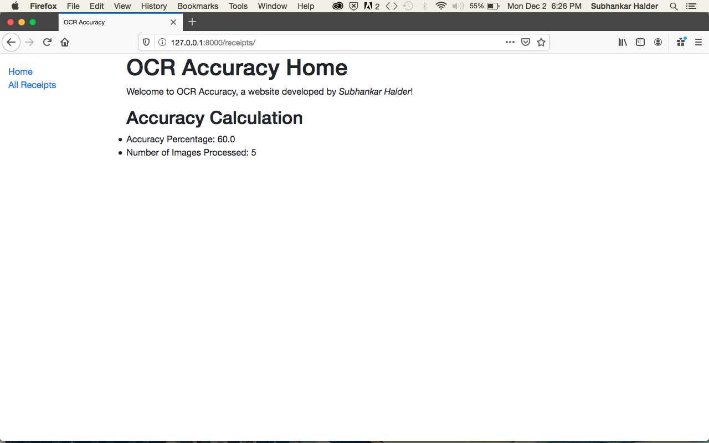

<!-- PROJECT LOGO -->
 

  

  <h3 align="center">A RESTful Service to extract dates from receipts</h3>
  <h4 align="center">Subhankar Halder</h4>
  

    A Django project that uses Google Cloud Vision API to do Optical Character Reading and measures the service's accuracy
     
    <a href="https://github.com/SubhankarHalder/OCR/tree/master/receipts"><strong>Explore the Project Application  »</strong></a>
     
     
    <a href="https://github.com/SubhankarHalder/OCR/tree/master/media/images">View Sample Receipts</a>
    ·
    <a href="https://github.com/SubhankarHalder/OCR/issues">Report Bug</a>
    ·
    <a href="https://github.com/SubhankarHalder/OCR/issues">Request Feature</a>
  

<!-- TABLE OF CONTENTS -->
## Table of Contents

* [About the Project](#about-the-project)
  * [Built With](#built-with)
* [OCR Engine](#OCR-engine)
* [Design Explanation](#design-explanation)
  * [Models Layer](#models-layer)
  * [Views Layer](#views-layer)
  * [Templates Layer](#templates-layer)
* [Possible Improvements](#possible-improvements)
* [Acknowledgements](#acknowledgements)

<!-- ABOUT THE PROJECT -->
## About The Project

![Product Name Screen Shot][product-screenshot]

The objective of the project is to develop a RESTful service that extracts the receipt date from a set of receipts. The receipt date is also known as the expense date. A sample receipt is shown below:

![Receipt Photo][receipt-photo]

The receipts are uploaded by the admin along with the actual date listed in the receipt. Since certain receipts could have no expense date, the service's database is allowed to record null dates. A screenshot of the admin view is shown below:

![Admin View][admin-view]

Once uploaded, the images were stored in their original JPEG format. When a user loads the website's index page in their browser, the following actions take place:

* BASE64 Serialization: The images are converted to their Base64 counterparts.
* VISION API POST Request: A POST request is sent to the VISION API with the image as the argument in its Base64 format
* Receive JSON Response: The VISION API sends a JSON response containing the OCR details
* Process and pass through REGEX: The JSON is processed to a string and passed through several regular expressions to extract possible date values
* DateUtil: The values are passed through the parse module of DateUtil to return a date
* Extracted Date: This date is posted as the "Extracted Date" of the receipts on the database
* FrontEnd: On the FrontEnd the user can view the calculated accuracy of the OCR exercise
* Detailed Views: The user can also view a second page highlighting the list of receipt file names, their actual and their extracted dates. A screenshot of the detailed view is shown below:

![Detail View][detail-view]

### Built With

* [Django](https://www.djangoproject.com/)
* [Google Cloud Vision API](https://cloud.google.com/vision/)
* [DateUtil Library](https://dateutil.readthedocs.io/en/stable/)

<!-- OCR Engine -->
## OCR Engine

One of the most difficult choices to make during this project was to decide on the OCR engine. I narrowed down to Tesseract and Google Vision API. With Tesseract, I would have to do a lot of preprocessing with the images. On the other hand, with Google Vision API, all I required was the API key. Further, I read about how Google Vision AI does not do a lot of preprocessing of the images but relies on its neural net to "implicitly" figure out the contrasting elements in the document. 

<!-- Design Explanation -->
##  Design Explanation

This project uses Django to build the RESTful service. Since this project involves a lot of request routing, the business logic has been written in the View module of the Django framework. The templates serve the frontend with simple HTML and CSS stylesheets. 

_Please Note: In Django terminology, OCR is the project and Receipts is the application. The core logic of this project resides in the application, that is Receipts._

### Models Layer

The Models module of Django comprises just one class called Photo which stores the receipt title, picture, its actual date and the extracted date. 

### Views Layer

The Views module forms the crux of the project with sending POST requests to the Vision API, processing and passing information through REGEX and calculating the service's accuracy.

### Templates Layer

The Templates module stores the HTML and style sheets. It serves its contents on the requests of the URL and the Views module. 

<!-- Possible Improvements -->
## Possible Improvements

* The business logic could be moved to a separate layer 
* API key should be moved to an env file
* PEP-8 guidelines should be followed
* REGEX could always be improved
* User could be allowed to upload a receipt rather than doing this on the admin level

<!-- ACKNOWLEDGEMENTS -->
## Acknowledgements

Special thanks to [Fyle](https://www.fylehq.com) for the receipt samples and the project brief.

<!-- MARKDOWN LINKS & IMAGES -->
<!-- https://www.markdownguide.org/basic-syntax/#reference-style-links -->
[product-screenshot]: presentation/Pic3.png
[receipt-photo]: media/images/0a0ebd53.jpeg
[admin-view]: presentation/Pic1.png
[detail-view]: presentation/Pic2.png
